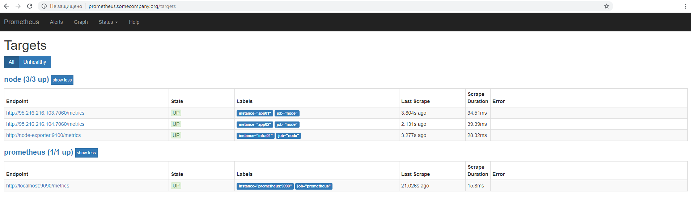
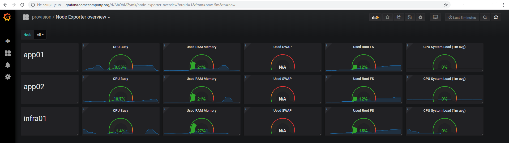

# Введение

Panda - утилита для централизованного управления конфигурацией систем и компонентов на множестве серверов. Концепция утилиты, в целом, похожа на ansible, но имеет некоторые особенности.

Что общего с ansible:

* без агентная система, доступ к серверам осуществляется по ssh и установки какого-либо дополнительного ПО на серверах не требуется
* использование шаблонов конфигурации
* возможность переноса конфигурации на удалённые сервера из центрального источника
* возможность выполнять любые действия на множестве серверов одной командой

Что особенного:

* конфигурация panda строится вокруг концепции компонента, который соответствует некоторому шаблону, который установлен на определённый хост. Компонент является центральной сущностью конфигурации и представляет собой отдельный экземпляр приложения или какой-либо другой сущности, например БД, конфигурации firewall и т.п., для которой могут быть определены команды deploy/undeploy/start/stop.
* panda способна не только копировать конфигурацию приложений на множество серверов, но и может собирать её обратно, с серверов в локальную папку, что может быть полезно для проведения инвентаризации конфигов. Ввиду наличия этой возможности, нет необходимости запрещать правку конфигурации непосредственно на серверах, поправив конфигурацию непосредственно на удалённом сервере, вы в дальнейшем сможете сделать действие pull и перетащить конфигурацию в локальную папку !pull и затем обратно в шаблоны.
* panda использует гибкий движок шаблонов Freemarker и предоставляет полный набор свойств вашей конфигурации для использования в макроподстановках. Благодаря этой модели вы можете использовать в шаблонах абсолютно любые данные из вашей конфигурации. Одним из интересных вариантов этого подхода является так называемый "compile-time service discovery", когда с помощью шаблонов, вы можете рендерить в конфигах списки компонентов и серверов определённых типов, подставлять пароли БД определённые при создании БД и т.п.
* рендеринг шаблонов конфигурации происходит локально, что сильно упрощает отладку конфигов
* все действия, которые panda производит на удалённых серверах, сначала рендеряться и сохраняются в bash-скрипты. Таким образом, вы можете вычитать все действия, которые производит панда, и выполнить их вручную.
* все команды, выполняемые на управляемых машинах, кодируются на bash-скриптах (хотя могут быть и другие варианты), что снижает порог вхождения и улучшает читабельность кода, т.к. писать скрипты на bash'е умеет каждый администратор и программист, даже если он и не знаком с devops-утилитами типа ansible или puppet
* panda написана на Java и очень легковесна. При необходимости что-либо отладить или дописать - вы можете с лёгкостью это сделать, и вряд ли вам понадобится более 1-2 дней на то, чтобы вычитать код всего проекта.
* встроенная поддержка шифрования паролей - позволяет хранить пароли в системе контроля версий в шифрованном виде. master-password для чтения секретной информации вы сможете задать либо в консоли, либо в локальном конфигурационном файле. 

О названии: оно произошло из игры слов: Kung Fu Panda -> Config Panda (config-panda) -> просто Panda. 

# Установка

## Установка из пакета

1. Скачать сборку (TBD)
2. Распаковать в папку /opt/panda
3. Создать symlink на исполняемый файл 
```
sudo ln -s /opt/panda/bin/panda.sh  /usr/local/bin/panda
``` 
4. Создать файл ~/.panda.properties указав в нём следующие параметры:
 * config_folder - путь к папке с конфигурацией, по умолчанию - ```.``` 
 * ssh_user, ssh_pass - пароль для ssh-пользователя для выполнения действий на подчинённых серверах
 * ssh_key_path (опционально) - путь до приватного ssh ключа.
 * master_pass - пароль для шифрования/дешифровки секретных данных.
 * env - в случае, если ваша конфигурация предполагает наличие только одного окружения, можно указать здесь его имя. 

## Установка из исходного кода для разработки

1. установить необходимые зависимости
    ```
    sudo yum install -y git java maven
    ```
1. склонировать репозиторий
    ```
    git clone https://bitbucket.org/just-ai/panda.git
    ```
1. перейти в папку проекта
    ```
    cd panda
    ```
2. выполнить сборку командой 
    ```
    mvn clean package -P DEV
    ```
3. Создать symlink на исполняемый файл
    ```
    sudo ln -s `pwd`/target/panda/bin/panda.sh  /usr/local/bin/panda
    ``` 
4. После этого вы сможете пересобирать утилиту командой mvn compile или действием Build Project в IDEA. Выполнять действие mvn package не потребуется.
5. Создать файл ~/.panda.properties так же как в разделе "установка из пакета" 

# Структура конфигурации

Давайте сначала определим основные понятия, которыми оперирует Panda.

* Окружение - логическая сущность, объединяющая набор серверов и компонентов в единое целое. Примеры окружений: тест, стейдж, прод, прод-для-особенного-клиента. В нашей конфигурации, окружение определяется папкой с файлом env.yml, имя папки становится именем окружения.
* Хост - это просто хост, который входит в состав окружения и на который можно что-нибудь установить. Хосты описываются в файле env.yml в секции hosts и содержат два обязательных параметра: name - короткое имя, используемое для ссылки на хост в рамках env.yml и fqdn.
* Компонент (экземпляр) - это экземпляр какого-либо сервиса или некая полезная функция, которая может быть установлена на определённый хост. Примеры компонентов: nginx, postgres, БД в postgres'е, настройки firewall'а (например компонент firewall-trusted-env, который помещает все хосты окружения в трастед-зону), и, конечно, наши собственные приложения, которые нам нужно администрировать.  Компонент характеризуется тремя обязательными полями:
 - уникальный идентификатор (например pg01x)
 - тип компонента (имя шаблона, например postgresql)
 - хост (или маска имён хостов)
* Шаблон компонента - это "код" компонента: шаблоны конфигурационных файлов, конфиг-мапа, набор скриптов для установки/запуска/остановки и других действий.


## Структура папок

Корневая папка конфигурации, например папка ./example в этом репозитори. Эта папка должна быть указана в параметре config, при вызове panda. Т.к. по умолчанию ```config_folder = .``` то следует просто запускать команду panda из папки ./example или переопределить параметр config_folder в файле ~/.panda.properties.

В папке ./example/Components находятся шаблоны компонентов. Например, Components/docker-prepare - шаблон компонента для настройки докер-сервиса. Именем компонента является имя папки docker-prepare и именно по этому имени мы будем обращаться к этому компоненту из файла env.yml. К структуре описания компонента мы вернёмся чуть позже.

Все другие папки в ./example/* (кроме Components) являются папками окружений. В данном примере у нас только одно окружение test. Имя окружения, с которым мы собираемся работать, задаётся в параметре env при вызове панда. Вы также можете использовать несколько уровней вложенности, ведь по сути, пара параметров config и env просто определяют путь к папке, содержащей файл env.yml

## env.yml

Внутри папки окружения находится файл env.yml. Разберём его структуру (порядок секций в env.yml значения не имеет, в нашем примере hosts определён в конце файла, в других - может быть определён в начале файла).

### hosts
В секции hosts описывается список хостов входящих в окружение и их короткие алиасы, которые мы будем использовать в env.yml для установки на них компонентов.

Для кажного хоста задаются параметры:

* name - короткое имя, алиас
* fqdn - fully qualified domain name - полное имя сервера или ip-адрес
* props - опциональный параметр, может содержать любые дополнительные свойства хоста для использования в макроподстановках

### components
Далее, в секции components задаётся конфигурация компонентов. 
Каждый компонент имеет следующие параметры:

* id - id - уникальный идентификатор компонента. На его основе формируются имена папок и другие идентификаторы. Уникальность идентификаторов проверяется при чтении конфига. 
Рекомендуется использовать составные идентификаторы, например: us__app__tomcat01x, где us - локация, app - роль сервера, tomcat - имя сервиса, 01 - номер, x - идентификатор реплики. В дальнейшем вы сможете использовать символ * при выполнении команд, например ```panda.sh -env prod reload us__app__tomcat*``` - сообщит системе, что требуется обновить конфигурацию всех ```tomcat``` в ```us```. 
* component - имя шаблона компонента. По сути это просто имя папки в Components
* host - имя хоста, или список имён, или плейсхолдер. Задаёт список хостов, на которые устанавливается компонент. Например, '*' - применит компонент ко всем серверам, указанным в секции hosts.
* props - опциональный параметр, задаёт произвольный набор свойств для использования в макроподстановках через ${props.xxx}. Если одно и тоже свойство встречается в нескольких компонентах, то его можно вынести в глобальную секцию props и объявить только один раз. Кроме того, свойства могут быть определены в самом компоненте в файле component.yml и в секции hosts.
* config - имя папки с файлами, переопределяющими дефолтные настройки компонента. Имя папки задаётся относительно папки окружения. В случае если эта папка указана, то при рендеринге конфигурации система сначала срендерит конфигурационные файлы из шаблона, а затем из этой папки config и запишет их поверх дефолтных. Таким образом получается, что конфигурация заданная в папке config является более приоритетной.

### props
Следующая и последняя часть файла env.yml - секция props, в которой определяются глобальные свойства окружения, которые могут быть использованы в любых шаблонах. 

# Структура описания шаблона компонента

Компоненты описываются в папке <config>/Components, имя папки является именем компонента. В каждом компоненте должен содержаться файл component.yml, могут находиться папки config - с шаблонами конфигурационных файлов и папка scripts, с управляющими скриптами.

## component.yml
Рассмотрим структуру файла component.yml

Файл component.yml состоит из следующих секций:

* props - задаёт дефолтные значения свойств компонента
* commands - задаёт маппинг команд и управляющих скриптов
* configMap - определяет расположение конфигурационных файлов компонента на сервере.


### props

Содержит произвольный набор свойств, для использования в макроподстановках внутри шаблонов.

Например:
```yaml
props:
  port: 1210
  prometheusPort: 1215
  healthCheck: true
```

К свойствам компонента можно будет обращаться из шаблонов как ```${props.port}```. Свойства компонента могут быть переопределены при объявлении экземпляра компонента в env.yml в секции components или в глобальных свойствах окружения в секции props файла env.yml

### commands
В секции commands определяется маппинг комманд и выполняющих их скриптов.

```yaml
commands:
  script: control.sh
  commands:
    deploy:
      cmd: ./deploy.sh

```

В поле ```commands.script``` - задаётся скрипт, обслуживающий все команды, если для них не задано отдельных скриптов в секции commands. В поле ```commands.commands``` - можно опционально задать отдельные скрипты для выполнения отдельных команд. Например в примере выше задаётся отдельный файл для команды deploy. Аналогичным образом могут быть заданы скрипты и для всех других команд, таких как start/stop и т.п.

Местоположение всех файлов, указанных в этой секции задаётся относительно папки scripts в папке с компонентом.

### configMap

```yaml
configMap:
  - source: application.yml
    target: /etc/justai/botserver/application.yml
    mkdirs: true
    user: botserver
  - source: botserver.cfg
    target: /etc/justai/botserver/botserver.cfg
    user: botserver
    optional: true
```

В этой секции задаётся маппинг файлов конфигурации из локальной папки config на нужные пути на удалённом сервере. Каждый элемент массива configMap может содержать следующие параметры:

* source - обязательный параметр, имя локального файла в папке config
* target - обязательный параметр, путь к файлу на сервере
* mkdirs - указывает, нужно ли создавать родительские папки
* user - указывает от имени какого пользователя создавать файл.
* mode - с какими пермиссиями создавать файл
* directory - указывает обрабатывать файл как папку. В этом случае будет скопировано всё содержимое папки source в папку target
* optional - указывает является ли файл обязательным, т.е. выкидывать ли ошибку, если файл не существует.


# Команды

Основными командами panda являются действия: render, push, deploy и pull. Ниже они будут подробно описаны, а здесь рассмотрим свойства, общие для всех команд.

Для вызова всех команд необходимо задать используемое окружение, либо в параметрах командной строки: ```panda.sh -env test-htz pull```, либо в конфигурационном файле ~/.panda.properties ```env=test-htz``` (см. раздел Установка)

Все команды, выполняющие действия над компонентами, принимают в последнем параметре id компонента, над которым требуется выполнить действие. В качестве id может быть задан список и использованы плейсхолдеры *. Если id компонента не указано, то действия будут применены ко всем компонентам окружения.   

## Основные команды

### render
```
panda.bat -env <environment> render [component-id] 
```
Команда срендерит конфигурационные файлы компонента в папку ```<config>/<env>/!render/<host>/<component-id>```

### push
```
panda.bat -env <environment> push [component-id] 
```
Команда сначала рендерит, затем копирует конфигурационные файлы для указанного компонента (или для всего окружения) на сервер, сохраняет их на сервере в папке ```~/panda/<component-id>``` и раскладывает по нужным путям, сконфигурированным в ```configMap```. 


### deploy
```
cm.bat -env <environment> deploy [component-id] 
```    
Команда выполняет деплой компонента. Действие deploy предварительно выполняет действия render и push. Таким образом деплой выполняется в следующей последовательности:

* в фазе render выполняется обработка шаблонов, в том числе, выполняются макроподстановки в файле control.sh (или deploy.sh, если он указан в конфигурации компонента)
* в фазе push этот скрипт, вместе со всей прочей конфигурацией компонента, переезжает на сервер
* в фазе deploy этот файл просто выполняется на удалённом сервере путём вызова команды либо ```control.sh deploy``` либо просто ```deploy.sh```, в зависимости от конфигурации компонента.

### pull
```
cm.bat -env <environment> pull [component-id] 
```
Команда команда забирает конфигурационные файлы для указанного компонента (или для всего окружения) и сохраняет их в папку ```config/<env>/!pull/<host>/<component-id>```. 


## Дополнительные команды

Следующие команды являются вспомогательными, работают аналогично команде deploy и по сути являются просто вызовами соответствующей команды на скрипте ```control.sh``` компонента. Для большинстава компонентов, эти команды просто делегируются в вызовы ```systemctl```.

* reload
* start
* stop
* restart

## Действия шифрования/дешифрования секретных данных

### encrypt
```
panda.bat -env test encrypt MY_PASSWORD
```
Действие позволяет зашифровать строку с помощью ```master_pass``` задаваемом в локальном конфиге (~/.panda.properties).
Зашифрованные свойства можно использовать в env.yml в виде:

```yaml
components:
  - id: app
    props:
      db_password: SECRET:<строка из encrypt>
```

### decrypt
```
panda.bat -env test decrypt <строка сгенерированная командой encrypt>
```
Действие позволяет расшифровать строку, созданную ранее действием encrypt.

# Пример конфигурации

В качестве примера мы приводим конфигурацию небольшого окружения из нескольких хостов, с установленной системой мониторинга, которая позволяет собирать метрики производительности этих хостов и выводит их в grafana.

После установки prometheus и grafana должны выглядеть примерно следующим образом:





Конфигурация находится в папке ./example, окружение test, и содержит следующее:

* окружение состоит из трёх нод
* на всех нодах установлен docker и firewalld
* все ноды объединены в доверенную зону firewalld
* на узле infra01 установлена система мониторинга: prometheus/grafana
* на всех узлах установлен node-exporter и подключен к мониторингу

Для воспроизведения этого примера вам понадобится следующее:

1. установить panda
2. зарегистрировать три виртуалки на любом хостинге, установить на них CentOS 7
3. установить суперпользователю одинаковый пароль, или создать другого пользователя с разрешением на sudo. Если создавать отдельного пользователя, то для него потребуется задавать два особенных флага: NOPASSWD и !requiretty. Примерно так:  
    ```
    panda  ALL=(ALL)    NOPASSWD: ALL
    Defaults:panda !requiretty
    ```
4. прописать в ~/.panda.properties параметры:
    ssh_user=<имя пользователя>
    ssh_pass=<пароль пользователя>
5. прописать адреса ваших хостов в файле env.yml
7. в папке ```./example``` выполнить команду ```panda -env test deploy -y```
8. зарегистрировать в локальном dns адреса для тестов:
    *  prometheus.somecompany.org
    *  grafana.somecompany.org 
9. После этого вы сможете обратиться к сервисам prometheus/grafana по этим именам через браузер. Приложения закрыты basic-аутентификацией, логин: mon-admin/mon-admin


# TODO:

- больше примеров конфигурации
- тэги - для выбора зон/хостов/типов компонентов для установки
- порядок выполнения тасок по порядку определения компонентов
- dependsOn
- сохранение прогресса и флаг continue
- темплейты компонентов (наследование компонентов)
- формальная декларация свойств компонента (обязательных и опциональных)
- действия diff, status, check
- поддержка zones/namespaces
